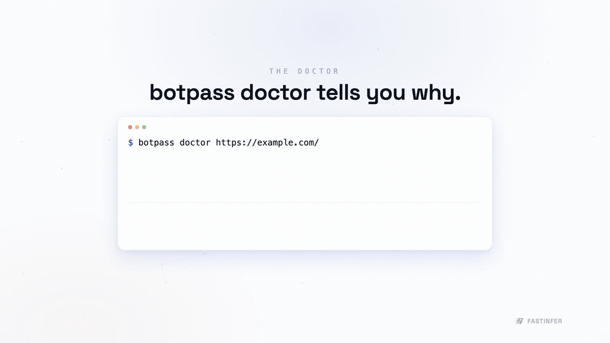

# botpass

[](https://github.com/AmirF194/botpass/actions/workflows/ci.yml)
[](LICENSE)


<p align="center">
  
</p>

<p align="center"><em><code>botpass doctor</code> sends a signed request, reads the response, and tells you why a blocked <code>403</code> becomes a verified <code>200</code>.</em></p>

Verified-bot identity for AI agents, using Web Bot Auth (a profile of
[RFC 9421](https://www.rfc-editor.org/info/rfc9421/) HTTP Message Signatures).

Sign your agent's outbound HTTP requests with an Ed25519 key, publish the public key at a
well-known directory, and check whether a site accepts the signature. Includes a `doctor`
command that sends a signed request and reports why it was accepted or rejected.

Background: Cloudflare, Akamai, and Fastly increasingly block AI agents and crawlers by default.
[Web Bot Auth](https://developers.cloudflare.com/bots/reference/bot-verification/web-bot-auth/)
lets a legitimate agent prove its identity instead of being treated as a hostile scraper. Setting
it up by hand is fiddly, and a failed signature usually just returns `403` with no explanation.

## Install

Not on PyPI yet, so install from source:

```bash
git clone https://github.com/AmirF194/botpass
cd botpass
pip install -e .
botpass demo
```

Python 3.9+. The only runtime dependency is `cryptography`.

## Demo

`botpass demo` starts a local reference verifier, sends one unsigned request and one signed
request, and prints the result. It runs in a single process, so it works offline with no setup.

```console
$ botpass demo

1. Unsigned request
   HTTP 403 Forbidden   missing Signature-Input header

2. Signed request
   HTTP 200 OK          verified (keyid ig0azrI2bZdo...)
```

## Usage

```bash
# create a keypair and a key directory
botpass init --agent https://your-bot.example

# print the JWKS to publish at /.well-known/http-message-signatures-directory
botpass directory

# send a signed request
botpass sign https://example.com/

# check why a URL accepts or rejects your signed agent
botpass doctor https://example.com/
```

`botpass doctor` sends a signed request, reads the response, and prints a checklist:

```console
$ botpass doctor http://localhost:8088/whoami

  ok   Bot identity                       keyid RtsLV3gfcK73Ql4_...
  ok   Signature is well-formed and cryptographically valid
  ok   Key directory reachable and publishes this key
  Probing the target
  -    Unsigned request                   HTTP 403
  ok   Signed request                     HTTP 200

  Verified-bot access is working: signing changed HTTP 403 to 200.
```

When something is wrong it reports which check failed and how to fix it: expired signature, clock
skew, unreachable directory, key not listed, missing `tag="web-bot-auth"`, and so on.

## Commands

| Command | What it does |
|---------|--------------|
| `botpass demo` | Run the unsigned/signed flow against a local verifier. No setup. |
| `botpass init --agent <url>` | Create a lasting identity (keypair + directory). |
| `botpass directory` | Print the JWKS to host at the well-known path. |
| `botpass serve` | Serve your key directory locally (and verify requests). |
| `botpass sign <url>` | Send a Web-Bot-Auth-signed request. |
| `botpass doctor <url>` | Diagnose why a URL blocks or accepts your signed agent. |
| `botpass verifier` | Run a reference verifier for others to test against. |

## Use it in your code

Signing is one line — hand a botpass auth object to the HTTP client you already use. Every
outbound request gets a fresh Web Bot Auth signature (re-signed per call, so it never expires
mid-session). Run `botpass init --agent <url>` once, then:

```python
import requests, botpass
requests.get("https://example.com/", auth=botpass.requests_auth())

import httpx, botpass
httpx.get("https://example.com/", auth=botpass.httpx_auth())
```

`requests` and `httpx` are optional extras (`pip install "botpass[requests]"` /
`"botpass[httpx]"`); botpass itself needs only `cryptography`. Driving a different client?
`botpass.signed_headers(url)` returns the headers as a plain dict to merge in yourself.

## How it works

Web Bot Auth signs at least the `@authority` derived component and a `Signature-Agent` header,
with the parameter `tag="web-bot-auth"`. Three request headers carry it:

- `Signature-Agent`: the origin that hosts your key directory.
- `Signature-Input`: the covered components plus `created`, `expires`, `keyid`, `tag`.
- `Signature`: the Ed25519 signature over the RFC 9421 signature base.

A verifier fetches `<Signature-Agent>/.well-known/http-message-signatures-directory` (a JWKS),
looks up the key by its RFC 7638 thumbprint (`keyid`), and verifies the signature. The
implementation of that slice lives in [`src/botpass/rfc9421.py`](src/botpass/rfc9421.py).

## Status

Alpha (v0.1). Signing, verification, the directory, and doctor work and are covered by tests
against a reference verifier. Interoperability with a specific CDN depends on that CDN having your
registered key. Doctor confirms your side is correct so you can register with confidence.

Drop-in signing for `requests` and `httpx` ships now (see
[Use it in your code](#use-it-in-your-code)).

Planned:

- Doctor checks for Cloudflare and Akamai rejection signals.
- Middleware for `aiohttp`, plus an async `httpx` example.
- A TypeScript/Node port.

Issues and PRs welcome. See [CONTRIBUTING.md](CONTRIBUTING.md).

## License

MIT. See [LICENSE](LICENSE).

## References

- [RFC 9421: HTTP Message Signatures](https://www.rfc-editor.org/info/rfc9421/)
- [Web Bot Auth (Cloudflare docs)](https://developers.cloudflare.com/bots/reference/bot-verification/web-bot-auth/)
- [cloudflare/web-bot-auth](https://github.com/cloudflare/web-bot-auth)
- [HTTP Message Signatures Directory draft](https://www.ietf.org/archive/id/draft-meunier-http-message-signatures-directory-01.html)
